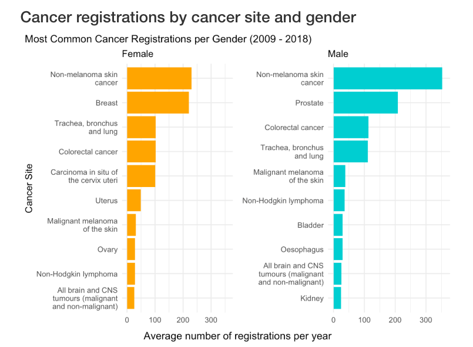
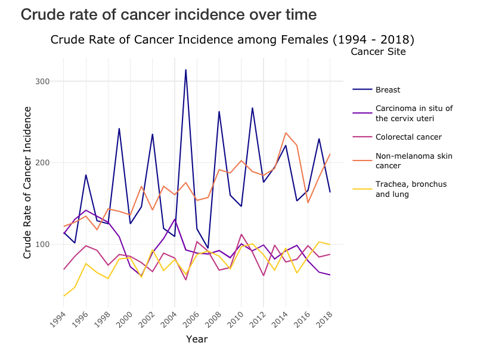
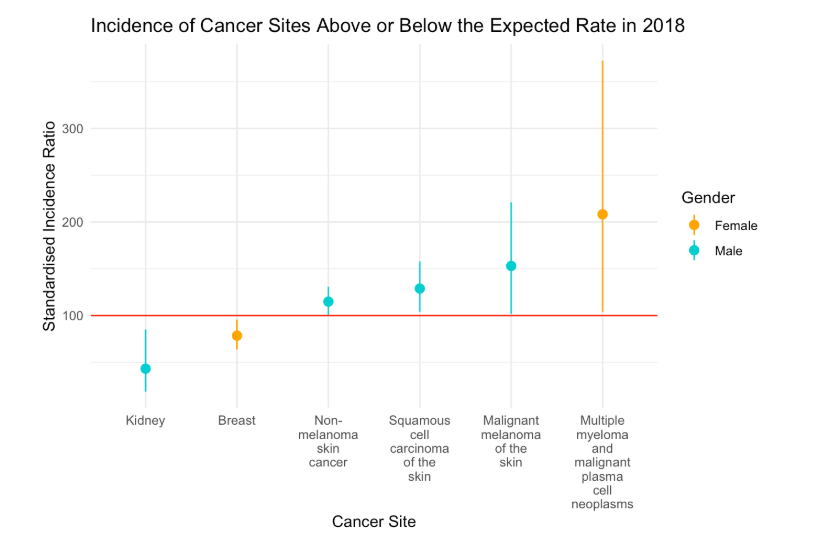

# Cancer Incidence in the Scottish Borders

This analysis reports on the incidence of cancer within the Scottish Borders NHS health board. Data includes cancer incidence by cancer site and gender for the years 1994 - 2018 and can be found [here](https://www.opendata.nhs.scot/dataset/annual-cancer-incidence). 

Full report including methodology, visualisations and summary statistics can be found in `cancer_borders_report.html`

Data dictionary and supplementary information on calculations can be found in `data_dictionary.txt`

## Figures

 

 

